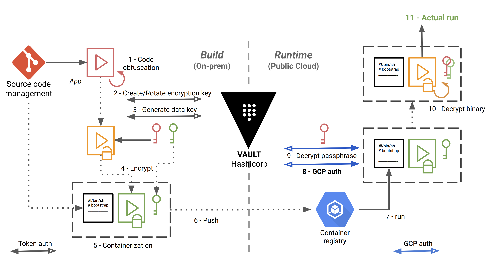
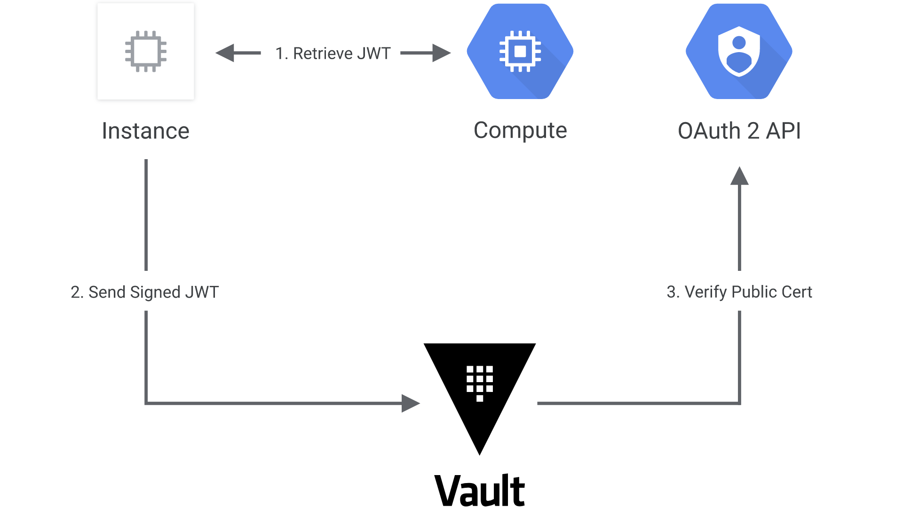
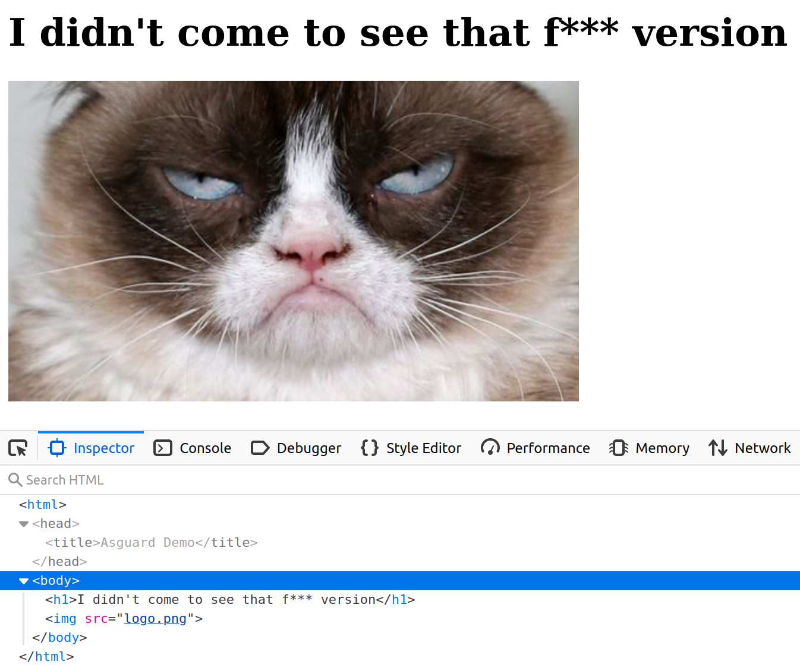
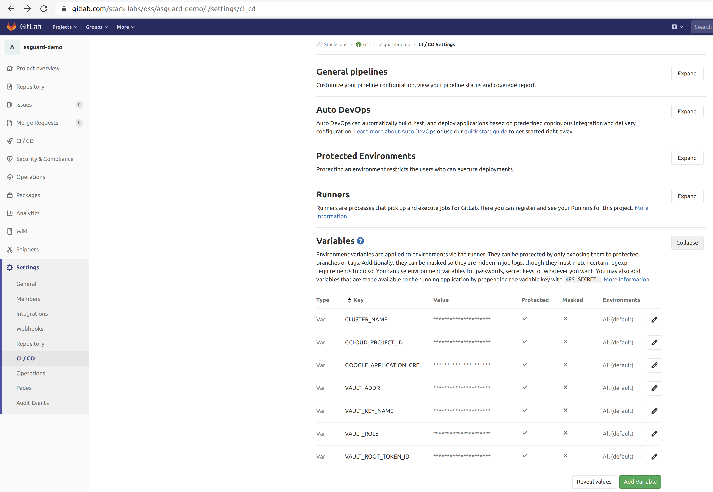
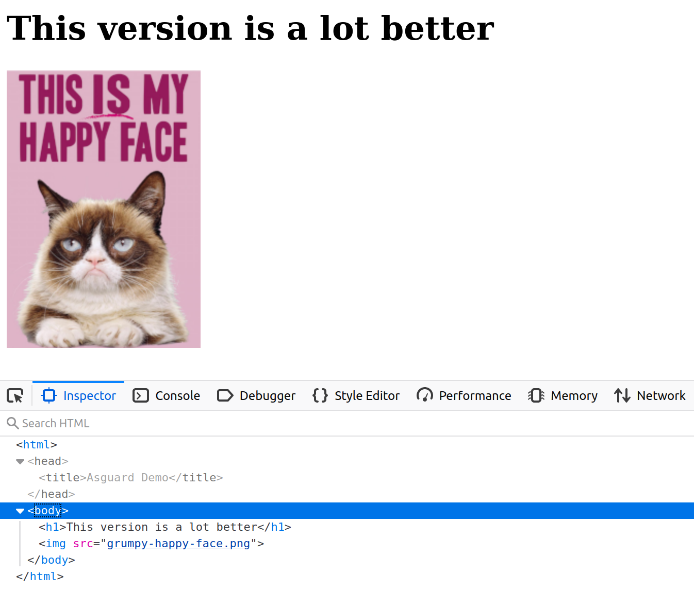

This article presents a security solution implemented as part of a project led by Stack Labs on behalf of one of our 
customers in the space sector. The purpose of this project was to migrate a legacy application to Google Cloud 
(*Lift & Shift*). It is a sensitive application, as its source code is the fruit of a real *savoir-faire* in satellite 
imagery analysis, with algorithms developed in-house over many years.  

<!--more-->
The application is protected by a legal framework which aims to protect access to the knowledge and technologies of the 
organization that requests it. Conversely, and as far as I understand, the said organization can be prosecuted if it 
does not put in place the necessary measures to protect their assets, like the access control, physical or digital, to 
sensitive information.

## Context
Our customer brings a lot of its activities into public cloud platforms and plans to do the same with this application, 
but in this particular case, *he* needed more security guarantees.

Yes, the cloud can be an important source of security risks. The cloud's responsibility for security essentially extends 
to the services provided, but not to the hosted applications. Thus, cloud providers already offer integrated security 
solutions at storage, infrastructure and network levels, but these may not be sufficient due to intellectual property or 
local regulations. The [OWASP](https://en.wikipedia.org/wiki/OWASP), in its 
["Cloud Top 10 Security Risks"](https://owasp.org/www-pdf-archive/Cloud-Top10-Security-Risks.pdf), reveals that data 
ownership and regulatory compliance are respectively the 1st and 3rd highest risks when migrating into the cloud. 
Businesses need additional guarantees and the ability to extend, or even replace, these security solutions to the 
applications themselves.

Here, our application is originally a desktop application. The long-term goal is to *servicize* it and use it as a main 
“shared library” among the satellite imagery services delivered to our customer's customers. 
The application is also a plain old good monolith, and will be broken later into microservices. The first project 
milestone was to take this monolith to the cloud and attach a REST API facade to it, and above all to put the security 
solution in place, and to test it.

## Security requirements
The security requirements are the following:

- **Execution control**: the application must be “enclaved”, that means the application can only be loaded and executed 
inside a trusted execution environment, here in this case a GCP project. The containerized application is 
basically encrypted at build time, then decrypted at runtime, with the help of Vault from Hashicorp. It should not be 
possible to decrypt the application outside of this execution context. *This article is mainly about how we fulfilled 
this requirement.*
- **Code obfuscation**: protection against reverse engineering. As a last bastion of security, and in the event that an 
attacker manages to grab the image, decrypt it and inspect it, the application source code must be obfuscated, so as to 
make it difficult for humans to understand.
- **Access control**: this is more classic. The application will expose a REST API. Access control is provided by an 
in-house API gateway - *a server program which is the only possible entry point and acts as an API front-end, receives 
API requests, passes requests to the back-end service(s) and then passes the response back to the requester* - that 
supports authentication, authorization, and security audit. The API gateway is used by many projects within our 
customer's organization and is an internal project by itself.

> _"The application can only be loaded and executed inside a trusted execution environment. A user should not be able to 
> inspect the contents of the application outside of this execution context."_

A last requirement, but not least, is to use only open source tools to implement this security solution, and to be cloud 
agnostic (you know, to change the provider if necessary).

## Secured CI/CD
We set up a CI/CD pipeline for building, securing and deploying the application into the targeted GCP project. [Vault 
from Hashicorp](https://www.vaultproject.io/) is the corner stone of this workflow. Vault provides secrets management, 
and encryption of application data (without storing it). In particular, you can generate, use, rotate, and destroy 
AES256, RSA 2048, RSA 4096, EC P256, EC P384 and EC P521 cryptographic keys. Vault provides a Web interface, as well as 
a CLI and a HTTP API, to interact with it. It can be viewed as "encryption as a service".

The CI/CD pipeline, implemented with Gitlab CI/CD, is as follows:



The steps are numbered and detailed below:

1. The source code is checked out, built and obfuscated.
2. We create (first time) or rotate (successive times) a "key encryption key" (KEK) in Vault. Here, we authenticate to 
Vault using a simple token, stored in a Gitlab protected environment variable.
3. Envelope encryption: we implement a key hierarchy with a local "data encryption key" (DEK), protected by the KEK. 
4. We make an archive out of the application, and we use the DEK to encrypt it using OpenSSL or GnuPG locally.
5. We store the encrypted application in a Docker container image, along with the **encrypted** DEK and a bootstrap bash 
script that will be used at runtime to decrypt and start running the application.
6. We push the image in Google Container Registry.
7. Self-starting process. The bootstrap script is the entrypoint of the Docker image. The workloads are orchestrated 
with Google Kubernetes Engine.
8. Here, we authenticate to Vault with a method specific to Google Cloud, detailed below.
9. We decrypt the DEK, by giving to Vault the ciphertext and the name of the KEK to decrypt against.
10. We decrypt the archive locally with OpenSSL or GnuPG, and we unpack the application. 
11. The application can finally do the job for which it is intended.

You may ask why we create the "intermediate" DEK (step 3) to encrypt the application (step 4) when we could directly 
encrypt the application with the KEK in the first place. This would require to send the whole application to Vault over 
the network. We would therefore take the risk of exposing the application in transit, even if TLS is enabled, and above 
all, the application can be heavy. 

So let's remember these two important definitions:
- **Data encryption key (DEK)**: is an encryption key whose function is to encrypt and decrypt data. The DEK is meant to 
be downloaded to encrypt the application locally.
- **Encryption key (KEK)**: is an encryption key whose function is to encrypt and decrypt the DEK. The KEK never leaves 
Vault.  

## Vault Auth methods
Authentication in Vault is the process of verifying that the system that logs in is which it says it is, and within a 
particular context. Vault supports multiple auth methods including Github, LDAP, AWS, Azure, Google Cloud, and more. 

Before a client can interact with Vault, it must authenticate against a chosen auth method. Once authenticated, a token 
is granted to the client, like a session ID, for subsequent exchanges with Vault.

In steps 2 and 8 above, we use two different methods to authenticate to Vault:

- At built time, we authenticate using the built-in token auth method (a simple password generated by Vault). This is a 
"shortcut" method, as if we were authenticating directly with the session ID mentioned above.
- At runtime, we authenticate with a method specific to Google Cloud, and this is precisely what will allow us to ensure 
that we are executing our application in our GCP project, and not elsewhere.

### Vault GCE Auth workflow
The gcp auth method allows Google Cloud Platform entities to authenticate to Vault. Vault treats Google Cloud as a 
trusted third party and verifies authenticating entities against the Google Cloud APIs. This Vault backend allows for 
authentication of Google Cloud IAM service accounts, but here we are interested by authenticating Google Compute Engine 
(GCE) instances that make up our Kubernetes cluster.

The auth method must be configured in advance before machines can authenticate. In particular, we must declare that only 
the machines in the targeted GCP project, in certain zones and with certain labels will be able to authenticate.

Also, the GCE instances that are authenticating against Vault must have the following role: 
roles/iam.serviceAccountTokenCreator

In order to check the authentication process, Vault itself must authenticate to the Google Cloud Platform. For that, 
we specify the credentials of a service account with the minimum scope https://www.googleapis.com/auth/cloud-platform 
and the role `roles/compute.viewer` or a custom role with the following exact permissions:

- `iam.serviceAccounts.get`
- `iam.serviceAccountKeys.get`
- `compute.instances.get`
- `compute.instanceGroups.list`
- `compute.instanceGroups.listInstances`

These allow Vault to:

- Verify the service account, either directly authenticating or associated with authenticating GCE instance, exists
- Get the corresponding public keys for verifying JWTs signed by service account private keys.
- Verify authenticating GCE instances exist
- Compare bound fields for GCE roles (zone/region, labels, or membership in given instance groups)

The following diagram shows how Vault communicates with Google Cloud to authenticate and authorize JWT tokens:




1. The client obtains an instance identity metadata token on a GCE instance.
2. The client sends this JWT to Vault along with a role name.
3. Vault extracts the kid header value, which contains the ID of the key-pair used to generate the JWT, to find the 
OAuth2 public cert to verify this JWT.
4. Vault authorizes the confirmed instance against the given role, ensuring the instance matches the bound zones, 
regions, or instance groups. If that is successful, a Vault token with the proper policies is returned.

See [https://www.vaultproject.io/docs/auth/gcp/](https://www.vaultproject.io/docs/auth/gcp/) for even more details.

## Putting the pieces together
Now that we have the theory, it is time to assemble things. As an example, our target application is a very basic 
web server in Python, serving files relative to its current directory:

```python
import SimpleHTTPServer
import SocketServer

PORT = 8000

Handler = SimpleHTTPServer.SimpleHTTPRequestHandler

httpd = SocketServer.TCPServer(("", PORT), Handler)

print "serving at port", PORT
httpd.serve_forever()
```

In particular, it will serve the following `index.html` page:



The goal of our demo will be to modify this index page, commit our changes, and create a git tag to see the CI 
automatically triggered and our new version deployed, and see in the meantime what are the security elements that have 
been applied.

### Code obfuscation
Code obfuscation is done by using a command line tool. A variety of tools exist to perform or assist with code 
obfuscation, and there is no such thing as a universal tool for obfuscation, as it depends of the architecture and the 
characteristics of the language.

We use [PyArmor](https://github.com/dashingsoft/pyarmor) to obfuscate our Python script above, and this will be 
typically the result:

```python
from pytransform import pyarmor_runtime
pyarmor_runtime()
__pyarmor__(__name__, __file__, b'\x50\x59\x41\x52\x4d\x4f\x52\x00\x00\x03\x05\x00\x17\x0d\x0d\x0a\x02\x00\x00\x00\x00\x00\x00\x00\x01\x00\x00\x00\x40\x00\x00\x00\x97\x01\x00\x00\x00\x00\x00\x18\x00\x00\x00\x00\x00\x00\x00\x00\x00\x00\x00\x00\x00\x00\x00\x00\x00\x00\x00\x00\x00\x00\x00\x00\xe0\x50\x8c\x64\x26\x42\xd6\x01\xf3\x0d\x68\x2c\x25\x9f\x19\xaa\x05\x4c\x7b\x3c\x45\xce\x28\xdf\x84\xef\xd3\x8e\xed\xac\x78\x4b\x2c\xc5\x39\x30\xcf\xc1\x8b\x68\x89\x12\x6a\xe2\x4a\x89\x4c\x3a\xf8\xbd\x5d\xb2\xc9\xea\xf8\x6e\x38\xa4\x87\x32\xa3\x44\xe1\x0c\x7c\x1c\x75\x30\xc0\xe7\x58\xe5\xad\x5b\xe6\xaa\x02\x76\x03\x59\x08\xc1\x4f\x69\x0f\xee\xf7\x42\xc3\x9c\x6f\xb0\x82\x0f\x2a\x55\x34\x6b\x4d\x3a\xd6\xb6\xae\xdf\x0b\x3c\xf9\x6f\xde\xef\x0f\x90\xd6\x75\x3b\xe8\xc1\xc8\x42\x2b\xb0\x5f\x54\x1d\xd9\xee\xcd\x5d\xa2\x09\xcb\x7b\x5c\xd5\x26\xc8\xf7\x00\x4e\xd3\x3b\xc7\x44\xca\x94\xa6\xdf\x00\x83\x59\x2d\x7b\x75\xf0\x03\x9e\xae\xe2\x79\x8d\xaa\xa0\xbf\x3b\xc0\xc1\x7b\xaa\x84\x7a\xc7\xcb\x33\x82\x54\x5a\x6a\x25\xea\x30\xc4\x53\x0b\x01\xd6\x36\x67\x28\xdb\x80\x19\xe6\x1a\x81\x76\x4a\xb4\x98\xef\xff\xaa\x25\xaa\xe2\x81\x93\x05\xf2\x78\x80\xc6\xc7\x76\x66\xf0\x44\xe0\x15\xec\xe4\xe2\x40\x19\x80\x72\xc2\x0b\x56\x8e\x5e\xe5\x8c\x6a\x14\x2c\x55\x2a\xc8\xdc\x7a\x3b\x69\x3c\x56\x12\xd0\x8a\xe5\x0d\x66\x8e\x51\x4a\xbd\xe7\x8b\x91\xfb\x68\x2d\x05\x9f\x29\x1d\xd5\xd7\x2f\x20\xd3\x89\x76\x14\x69\xe6\xc7\x1a\x54\xa2\xf4\x10\x5e\x6d\xcf\xb9\x54\xd1\x9f\x92\x78\xa5\xb9\xcf\x80\xee\x40\xb7\x04\xd6\xbf\xa9\xca\xc4\x3e\x17\x16\xd6\x9a\x47\xa3\x73\x35\xf6\xd7\xfc\xcc\x3c\x74\x12\x60\x68\x3b\x67\x97\x9f\x12\xc3\x0a\x59\x3e\xe5\xe9\x2d\xf5\xcf\x24\x06\x7d\xdf\xd3\x1a\xec\x3c\x3b\xe3\x8a\xed\x61\x6f\xfc\x49\x0a\xcf\x46\x53\xcb\x55\xdf\x1c\x37\x5b\x1e\xe8\x58\xeb\x94\x15\xdc\xb5\x65\xd1\x77\xaa\xa5\x3c\x24\xf5\x49\x10\x00\x69\x01\x2f\x8f\x51\x48\x49\xa5\xe7\x33\x8e\x04\xd0\x95\x59\xec\x17\x14\x01\x39\xf9\xb4\xbf\x68\xee\xa3\x8e\x73', 1)

```

The obfuscated script is a normal Python script, with an extra module `pytransform.py` and a few extra runtime files. 
The plain Python script can be replaced with the obfuscated one seamlessly.

Code obfuscation does not alter the output of a program, which remains fully functional. Just remember that code 
obfuscation is not encryption. It is just a way to delay human understanding of the code, and to make 
reverse-engineering of a program difficult and economically unfeasible, as this would need too much time and effort. 

### Vault configuration
Vault must be accessible from both build time and runtime environments. It can be deployed either on-premises or in the 
cloud, as long as this environment is trusted. This 
[guide](https://learn.hashicorp.com/vault/operations/production-hardening) provides guidance for a production hardened 
deployment of Vault. 

For the purposes of a demo, you can use the following script which automates the deployment and configuration of a 
Vault server in development mode:

```sh
#!/bin/bash

# Download Vault
VAULT_VERSION=1.2.3
curl https://releases.hashicorp.com/vault/${VAULT_VERSION}/vault_${VAULT_VERSION}_linux_amd64.zip -o vault.zip
unzip vault.zip
chmod u+x vault

export VAULT_ADDR=http://127.0.0.1:8200
export VAULT_ROOT_TOKEN_ID=root

# Start Vault in dev mode
nohup vault server -dev -dev-listen-address=0.0.0.0:8200 -dev-root-token-id=${VAULT_ROOT_TOKEN_ID} &

# Wait until the Vault server has actually started
sleep 5

# Login to vault
echo $VAULT_ROOT_TOKEN_ID | vault login --no-print=true -

# Enable the Transit secrets engine which generates or encrypts data in-transit
vault secrets enable transit

# Create dev policy
vault policy write asguard-policy policy-dev.hcl

# Enable the Google Cloud auth method
vault auth enable gcp

# Give Vault server the JSON key of a service account with the required GCP permissions:
# roles/iam.serviceAccountKeyAdmin
# roles/compute.viewer

# These allow Vault to:
# - Verify that the service account associated with authenticating GCE instance exists
# - Get the corresponding public keys for verifying JWTs signed by service account private keys.
# - Verify authenticating GCE instances exist
# - Compare bound fields for GCE roles (zone/region, labels, or membership in given instance groups)

vault write auth/gcp/config credentials=@credentials.json

# The GCE instances that are authenticating against Vault must have the following role: roles/iam.serviceAccountTokenCreator

ROLE=asguard-gce-role

# Create role for GCE instance authentication
vault write auth/gcp/role/${ROLE} \
    type="gce" \
    policies="asguard-policy" \
    bound_projects="asguard" \
    bound_zones="europe-west1-b" \
    bound_labels="foo:bar,zip:zap,gruik:grok"
```

with `policy-dev.hcl`:

```
# This section grants all access on "transit/*".
path "transit/*" {
  capabilities = ["create", "read", "update", "delete", "list"]
}
```

Vault provide many "[secrets engines](https://www.vaultproject.io/docs/secrets)" to store, generate, or encrypt data. 
Here, we use the [transit](https://www.vaultproject.io/docs/secrets/transit) secrets engine to handle cryptographic 
functions on data in-transit only. With the exception of the main key (KEK), Vault doesn't store the data sent to the 
secrets engine. 

The last section in the bash script states that only GCE instances in the GCP project named "asguard", in the zone 
`europe-west1-b` and with the labels `foo:bar`, `zip:zap`, and `gruik:grok` will be able to authenticate to Vault. 

### The Docker images

We distinguish 2 containers for our app: the app container itself, and one 
[init container](https://kubernetes.io/docs/concepts/workloads/pods/init-containers/), which is a specialized container 
that will run before the app container in a Kubernetes pod. The init container contains the bash script that will 
decrypt then start the application.  

Here is our pod configuration:

```yaml
apiVersion: v1
kind: Pod
metadata:
  name: asguard-demo
  labels:
    app: asguard-demo
spec:
  containers:
  - name: asguard-demo
    image: eu.gcr.io/$GCLOUD_PROJECT_ID/$CI_PROJECT_NAME:$CI_COMMIT_TAG
    imagePullPolicy: Always
    ports:
    - containerPort: 8000
    env:
      - name: BOOTSTRAP_DIR
        value: /asguard
      - name: CACHE_DIR
        value: /cache
      - name: VAULT_ADDR
        valueFrom:
          secretKeyRef:
            name: vault-secret
            key: vault-addr
      - name: VAULT_KEY_NAME
        valueFrom:
          secretKeyRef:
            name: vault-secret
            key: vault-key-name
      - name: VAULT_ROLE
        valueFrom:
          secretKeyRef:
            name: vault-secret
            key: vault-role
    volumeMounts:
      - name: workdir
        mountPath: /asguard
      - name: cache-volume
        mountPath: /cache
  # These containers are run during pod initialization
  initContainers:
  - name: install-bootstrap
    image: eu.gcr.io/$GCLOUD_PROJECT_ID/init-$CI_PROJECT_NAME:$CI_COMMIT_TAG
    command:
      - cp
      - "-R"
      - "."
      - "/work-dir"
    volumeMounts:
      - name: workdir
        mountPath: "/work-dir"
  dnsPolicy: Default
  volumes:
  # Volume shared by init and app containers
  - name: workdir
    emptyDir:
      medium: Memory
  # Volume to decrypt the application in memory
  - name: cache-volume
    emptyDir:
      medium: Memory
```

In the configuration file, you can see that the pod has a volume that the init container and the application container 
share.

The init container mounts the shared Volume at `/work-dir`, and the application container mounts it at `/asguard`. The 
init container runs the following command and then terminates:

```
cp -R . /work-dir
```

The command copies the bootstrap script and other utilities from the init container's working directory to the shared 
volume. This done, the application container has now access to the bootstrap script, which is its actual entrypoint.

The app container has another `tmpfs` mount at `/cache`. A tmpfs volume is a RAM-backed filesystem, that means a 
tmpfs mount is temporary, and only persisted in the host memory and outside the container's writable layer. This is 
particularly useful to decrypt our application in this directory: when the container stops, the tmpfs mount is removed, 
and files written there won't be persisted.


Here is the Dockerfile for our application image:

```
# Start by obfuscating the application
FROM python:3.5.3-slim AS obfuscate

RUN pip install pyarmor
COPY app/sensitive-app.py app/
# Python version must be the same as the target version in the final image
RUN pyarmor obfuscate app/sensitive-app.py
# Creates a folder dist with the obfuscated Python script


# Then encrypting the application
FROM gcr.io/distroless/base:debug AS build-env

SHELL ["/busybox/sh", "-c"]

# Define build arg
ARG VAULT_KEY_NAME

# Define env variable
ENV VAULT_KEY_NAME ${VAULT_KEY_NAME}

ARG VAULT_ADDR
ARG VAULT_ROOT_TOKEN_ID

WORKDIR /dist
ENV PATH /dist:${PATH}

# Install jq
ARG JQ_VERSION=1.6
RUN wget https://github.com/stedolan/jq/releases/download/jq-${JQ_VERSION}/jq-linux64 -O jq
RUN chmod u+x jq

# Embed the application. DO NOT USE ADD HERE!
COPY app/ app/
# With only the obfuscated Python script
RUN rm app/sensitive-app.py
COPY --from=obfuscate /dist/ app/

# Package the application
RUN tar cvf app.tar.gz app/

# Create a named encryption key
# If the key already exists, this has no effect
RUN wget \
    --header "X-Vault-Token: ${VAULT_ROOT_TOKEN_ID}" \
    --post-data "" \
    ${VAULT_ADDR}/v1/transit/keys/${VAULT_KEY_NAME}

# Rotates the version of the named key
RUN wget \
    --header "X-Vault-Token: ${VAULT_ROOT_TOKEN_ID}" \
    --post-data "" \
    ${VAULT_ADDR}/v1/transit/keys/${VAULT_KEY_NAME}/rotate

# Generate data key
# The name specified as part of the URL is the name of the encryption key
# created in the init container and used to encrypt the datakey
RUN wget \
    --header "X-Vault-Token: ${VAULT_ROOT_TOKEN_ID}" \
    --post-data "" \
    ${VAULT_ADDR}/v1/transit/datakey/plaintext/${VAULT_KEY_NAME} -O datakey.json

RUN cat datakey.json | jq -r ".data.ciphertext" > passphrase.enc

# Encrypt the binary with the plaintext key 
RUN cat datakey.json | jq -r ".data.plaintext" | openssl aes-256-cbc -salt -in app.tar.gz -out app.enc -pass stdin

# Delete unsecured files (delete all files that do not match *.enc)
RUN find /dist/* ! -name '*.enc' -exec rm -rf '{}' +

RUN chmod -R 500 /dist


# App container
FROM gcr.io/distroless/python3

USER nobody:nobody
COPY --chown=nobody:nobody --from=build-env /dist/ /dist/
CMD ["python app/sensitive-app.py"]
# The entrypoint will be mounted from the init container
ENTRYPOINT ["/asguard/bootstrap.sh"]
```

And here is the Dockerfile for the init container:

```
FROM gcr.io/distroless/base:debug AS build-env

SHELL ["/busybox/sh", "-c"]

WORKDIR /asguard
ENV PATH /asguard:${PATH}

# Install jq
ARG JQ_VERSION=1.6
RUN wget https://github.com/stedolan/jq/releases/download/jq-${JQ_VERSION}/jq-linux64 -O jq

# Install cat, tar, wget and cp for bootstrap.sh later execution
ARG BUSYBOX_VERSION=1.30.0-i686
RUN wget https://busybox.net/downloads/binaries/${BUSYBOX_VERSION}/busybox_CAT -O cat
RUN wget https://busybox.net/downloads/binaries/${BUSYBOX_VERSION}/busybox_TAR -O tar
RUN wget https://busybox.net/downloads/binaries/${BUSYBOX_VERSION}/busybox_WGET -O wget
RUN wget https://busybox.net/downloads/binaries/${BUSYBOX_VERSION}/busybox_CP -O cp

COPY bootstrap.sh ./

RUN chmod -R 500 /asguard


# Init container
FROM gcr.io/distroless/base

USER nobody:nobody
COPY --chown=nobody:nobody --from=build-env /asguard /asguard
WORKDIR /asguard
ENV PATH /asguard:${PATH}
```

The two Dockerfiles alone will perform steps 1 to 5 of the CI pipeline. Nothing more than `docker build` is needed to 
create the automated build.

We can make some comments on these Dockerfiles:

- We use Docker [multi-stage builds](https://docs.docker.com/develop/develop-images/multistage-build/) to separate the 
main steps of image build and to keep the final images as light as possible.
- We use "[distroless](https://github.com/GoogleContainerTools/distroless)" images to harden the images as much as 
possible.
- Distroless images contain only the application and its runtime dependencies. They do not contain package 
managers, shells (you cannot even do a `ls` or a `cd`) or any other programs you would expect to find in a standard 
Linux distribution. You can find different distroless base images depending on your application stack: Java, Python, 
Golang, Node.js, dotnet, Rust.
- For intermediate build stages, we use distroless **debug** images which provide a [busybox](https://busybox.net/) 
shell. This allows to run all the necessary commands to actually build the image, and for the init image, to download 
and install all the busybox commands (`cat`, `tar`, `wget`, in a unitary way) needed for `bootstrap.sh` later execution 
in the non-debug final image. We also install `cp` that will be used to copy the bootstrap script in the shared volume.
- We use the HTTP API to interact with Vault. We could have added the CLI into the image, but it is more secure and 
lighter not to embed a tool that offers far more services that the ones we only need.
- As a consequence, we must install [jq](https://github.com/stedolan/jq) to process the JSON output from HTTP calls.
- We can use [OpenSSL or GnuPG](https://stackoverflow.com/questions/28247821/openssl-vs-gpg-for-encrypting-off-site-backups) 
to encrypt the application locally in the container. Here, we use OpenSSL as it is already shipped in distroless images.
- We run the final images with a non-root user.

The build commands are the following:

```
docker build -t init-asguard-demo -f Dockerfile-init .
```
```
docker build -t asguard-demo \
    --network=host \
    --build-arg VAULT_ADDR=https://vaulthost:8200 \
    --build-arg VAULT_ROOT_TOKEN_ID=s3cr3tt0k3n \
    --build-arg VAULT_KEY_NAME=aname \
    -f Dockerfile-app .
```

The final images are expected to run in Kubernetes (due to the init container and the mounted volumes), and the 
bootstrap script will attempt to authenticate to Vault with the GCP method. So, you won't be able to run the final 
images locally with the default entrypoint (and that is our goal).

If you edit the Dockerfile to change the final image to `:debug`, you can nevertheless get a busybox shell to enter 
and see that the application is indeed encrypted:

```
docker run -it --rm --entrypoint=sh asguard-demo:latest
```

### Gitlab CI/CD
[GitLab CI/CD](https://docs.gitlab.com/ee/ci/) is configured by a file called `.gitlab-ci.yml` placed at the 
repository’s root:

```yaml
stages:
  - build
  - deploy

build:
  stage: build
  image:
    name: gcr.io/kaniko-project/executor:debug
    entrypoint: [""]
  script:
    - export GOOGLE_APPLICATION_CREDENTIALS=/kaniko/kaniko-secret.json
    - echo $GOOGLE_APPLICATION_CREDENTIALS_BASE64 | base64 -d > $GOOGLE_APPLICATION_CREDENTIALS
    - /kaniko/executor --context $CI_PROJECT_DIR --dockerfile Dockerfile-init --build-arg VAULT_ADDR=$VAULT_ADDR --build-arg VAULT_ROOT_TOKEN_ID=$VAULT_ROOT_TOKEN_ID --build-arg VAULT_KEY_NAME=$VAULT_KEY_NAME --destination eu.gcr.io/$GCLOUD_PROJECT_ID/init-$CI_PROJECT_NAME:$CI_COMMIT_TAG
    - /kaniko/executor --context $CI_PROJECT_DIR --dockerfile Dockerfile-app --build-arg VAULT_ADDR=$VAULT_ADDR --build-arg VAULT_ROOT_TOKEN_ID=$VAULT_ROOT_TOKEN_ID --build-arg VAULT_KEY_NAME=$VAULT_KEY_NAME --destination eu.gcr.io/$GCLOUD_PROJECT_ID/$CI_PROJECT_NAME:$CI_COMMIT_TAG
  only:
    - tags


deploy:
  stage: deploy
  image:
    name: google/cloud-sdk:latest
  script:
    # Authenticate with GKE
    - echo $GOOGLE_APPLICATION_CREDENTIALS_BASE64 | base64 -di > key.json
    - gcloud auth activate-service-account --key-file=key.json
    - gcloud config set project $GCLOUD_PROJECT_ID
    - gcloud container clusters get-credentials $CLUSTER_NAME --zone europe-west1-b
    # Create Kubernetes secret with Vault info
    - kubectl delete secret vault-secret || true
    - kubectl create secret generic vault-secret --from-literal=vault-addr=$VAULT_ADDR --from-literal=vault-key-name=$VAULT_KEY_NAME --from-literal=vault-role=$VAULT_ROLE
    # Install envsubst
    - apt-get install -y gettext-base
    # Deploy
    - cat k8s/deployment.yml | envsubst | kubectl apply -f -

  only:
    - tags
```

The pipeline of scripts builds the images (steps 1 to 5), pushes them into the Google Container Registry (step 6), then 
deploys the application into GKE (step 7) at every tag in the `master` branch of the repository.  

Some observations that are worth noting:

- Each stage in the file is executed by the [Gitlab Runner](https://docs.gitlab.com/runner/) in a container image.
- Instead of `docker build`, we use [Kaniko](https://github.com/GoogleContainerTools/kaniko) to build the application 
images from the Dockerfiles. Kaniko is meant to be run inside a container or Kubernetes cluster. Kaniko does not depend 
on a Docker daemon and it is therefore an alternative to [Docker-in-Docker](https://hub.docker.com/_/docker), which is 
subject to potential security issues. 
- We use 
[protected environment variables](https://docs.gitlab.com/ee/ci/variables/README.html#protected-environment-variables) 
in Gitlab to configure the pipeline (Vault host, Vault's root token, Google credentials and so on). Protected variables 
are securely passed to the pipeline running.
- We use `envsubst` to substitute the values of environment variables into Kubernetes YAML files. I can already hear the 
haters saying that Kubernetes files should be template-free and should only be patched (see this other article on 
[kubectl kustomize](/code/kustomize-101)), but hey, this is a demo...😱



Gitlab itself must be a trusted part of the chain: it can be either self-hosted on-premises or online (SaaS). The Gitlab 
project must have at least restricted access to the only developers needed for the project. If online, the project 
repository should be private so as not to publish the source code publicly. Gitlab protects the source code with 
encryption in transit and at rest, and AFAIK you can manage your own encryption keys. Regardless of the project 
repository, the Gitlab Runner can also be installed on-premises. 

## Let's run
Here we are! We committed and pushed our changes, we created a git tag, the images have been pulled, and the Kubernetes 
pod has started. The bootstrap script can finally proceed:

```sh
#!/bin/sh

set -eux

VAULT_ADDR=${VAULT_ADDR}
VAULT_KEY_NAME=${VAULT_KEY_NAME}
VAULT_ROLE=${VAULT_ROLE}

WORK_DIR=/dist
CACHE_DIR=${CACHE_DIR:-/cache}

BOOTSTRAP_DIR=${BOOTSTRAP_DIR:-/asguard}
cd ${BOOTSTRAP_DIR}
export PATH=${BOOTSTRAP_DIR}:${PATH}

# Get the JWT token for the GCE instance that runs this container
INST_ID_TOKEN=$(wget \
  --header "Metadata-Flavor: Google" \
  "http://metadata.google.internal/computeMetadata/v1/instance/service-accounts/default/identity?audience=vault/${VAULT_ROLE}&format=full" -qO -)

AUTH_PAYLOAD="{\"role\": \"${VAULT_ROLE}\", \"jwt\": \"${INST_ID_TOKEN}\"}"

# GCE login
CLIENT_TOKEN=$(wget \
    --post-data "${AUTH_PAYLOAD}" \
    ${VAULT_ADDR}/v1/auth/gcp/login -O - | \
    jq -r '.auth.client_token')

PAYLOAD="{\"ciphertext\": \"$(cat ${WORK_DIR}/passphrase.enc)\"}"

# Decrypt the application
wget \
    --header "X-Vault-Token: ${CLIENT_TOKEN}" \
    --post-data "${PAYLOAD}" \
    ${VAULT_ADDR}/v1/transit/decrypt/${VAULT_KEY_NAME} -O - | jq -r '.data.plaintext' | openssl aes-256-cbc -d -salt -in ${WORK_DIR}/app.enc -out ${CACHE_DIR}/app.tar.gz -pass stdin

# Unpack
tar xvf ${CACHE_DIR}/app.tar.gz -C ${CACHE_DIR}

# Execute arg command
cd ${CACHE_DIR}
/bin/sh -c "$1"
```

The script performs final steps 7 to 11 of the CI pipeline. The last instruction executes the command 
`python app/sensitive-app.py` passed as an argument to the image's entrypoint. At this point, the application is now 
decrypted and unpacked: the Python web server can start and Grumpy the cat is now happy!

If you visit the [Kubernetes ingress](https://gitlab.com/stack-labs/oss/asguard-demo/-/blob/master/k8s/ingress.yml)'s 
endpoint, you will see the following web page:



Note that the self-starting process here can be implemented in whatever language that suits you: you can pick the right 
distroless image for the desired stack, and Vault provides many 
[client libraries](https://www.vaultproject.io/api/libraries.html) to consume the API more conveniently. 

## The "need to know", and the principle of the least privilege 
We cannot emphasize this enough, all these security measures are only relevant if all parts of the pipeline are trusted 
themselves. Most attacks are indeed initiated by users with regular access to the system or communication channel 
(man-at-the-end attack). That means Gitlab, Vault, the GCP project, and all communication media between them, must limit 
their access to the smallest number of people (developers, administrators). And within these systems, users must be able 
to access only the information and resources that are necessary for their job (ex: all users who end up to be 
administrators of all GCP projects in an organization, that is not a good thing).

### Decrypting in memory
We saw that the application is decrypted in memory in a tmpfs mount. If such a mount is temporary, the filesystem is 
still visible from the host. If an attacker has access to the Kubernetes node where the pod is running, he can find our 
sensitive source code:

```sh
# find / -name sensitive-app.py
/home/kubernetes/containerized_mounter/rootfs/var/lib/kubelet/pods/cb74781d-7fc7-11ea-adc6-42010a8400f8/volumes/kubernetes.io~empty-dir/cache-volume/app/sensitive-app.py
/var/lib/kubelet/pods/cb74781d-7fc7-11ea-adc6-42010a8400f8/volumes/kubernetes.io~empty-dir/cache-volume/app/sensitive-app.py
```

Of course the source code is obfuscated, but still. 

## What about trust?
When transferring container images over internet, _trust_ is a central concern. It would be good to ensure their 
integrity and that the CI pipeline is the source of these images. 

[Docker Content Trust](https://docs.docker.com/engine/security/trust/content_trust/) (DCT) provides this ability to use 
digital signatures for data sent to and received from remote Docker registries. These signatures allow client-side or 
runtime verification of the integrity and publisher of specific image tags.

Through DCT, the CI pipeline could sign the images and Kubernetes could ensure that the images it pulls are signed.
But a prerequisite for signing an image with DCT is a Docker Registry with a "notary" server attached (such as the 
Docker Hub). This is not currently supported in Google Container Registry (see 
[here](https://stackoverflow.com/questions/53380782/pushing-signed-docker-images-to-gcr?rq=1)).

Google Cloud now implements the concept of [Binary Authorization](https://cloud.google.com/binary-authorization?hl=en) 
based off of open source [Kritis](https://github.com/grafeas/kritis/blob/master/docs/binary-authorization.md). However, 
this is specific to Google Cloud and I don't know if it's possible to set up a vanilla Kritis there. 

With Vault, we could easily sign our application and verify this data from the bootstrap script. But then, an attacker 
could modify the script to not verify the data, and thus break the trust chain. Consequently, the script (or the init 
image) should also be signed. But it cannot verify itself, and we end up with a chicken-or-egg problem... 

## Criticism
An alternative to the images' build would be putting the encrypted datakey next to the bootstrap script in the init 
image, instead of placing it next to the application in the app image. In that way, we would separate the encrypted 
application from the key needed to decrypt it in two separate images. This may be viewed as an additional security. But 
in that case, the key must be created (or rotated) outside of Docker - as it must be both placed in the init image and 
used in the app image to actually encrypt it - and `docker build` alone does not suffice anymore to build the images. 
The first solution is therefore an assumed choice.

Also, the solution we presented here relies on mechanisms that are internal to the image: this is security by the 
contents, which is a form of security through obscurity.
Like `docker trust`, it would be nice if Docker could encrypt an image with a `docker encrypt` command line. The result 
image would be an envelope with clear metadata and encrypted contents.

## Links
We named this security solution for bringing sensitive apps into the cloud "Asguard". It is named after the location of 
Ásgard in the Norse religion (not Marvel, please 😠). Ásgard is an impregnable divine fortress surrounded by an 
impassable wall that shelters the gods from all invasions.

We made a demo which includes all the elements explained in this article. You will find the source code 
[here](https://gitlab.com/stack-labs/oss/asguard-demo).

We also presented this subject at the "Capitole du Libre" conference at Toulouse in November 2019. Here is the YouTube 
[video](https://youtu.be/bLoNUJizaSI) (in French):

[](https://youtu.be/bLoNUJizaSI)

## See also
- [rkt](https://coreos.com/rkt/): an alternative to Docker with security as a first-class citizen (container isolation, 
seccomp, SELinux, non-root user, containers are signed and verified by default)
- [Mozilla SOPS](https://github.com/mozilla/sops): an alternative to protected environment variables in Gitlab. You can 
store encrypted values directly in git-versioned files.
- [kubesec](https://github.com/shyiko/kubesec): like SOPS, but dedicated to Kubernetes secrets only. This 
[article](/code/keep-your-kubernetes-secrets-in-git-with-kubesec/) on our blog introduces kubesec.
- [vault-k8s](https://www.vaultproject.io/docs/platform/k8s/injector): Vault is used more and more for managing 
Kubernetes secrets.
