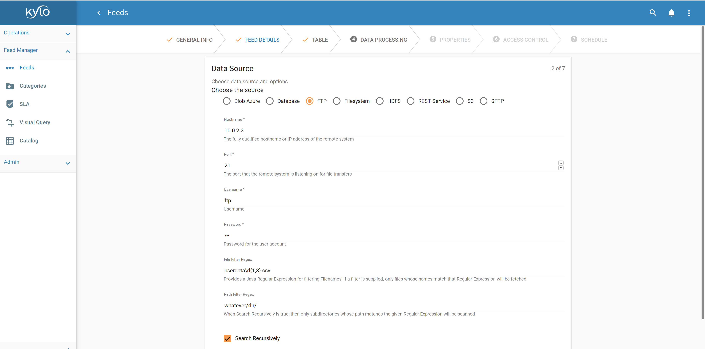
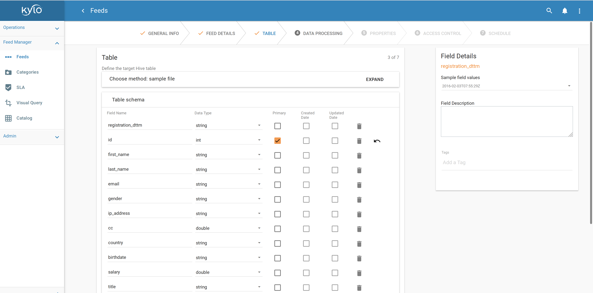
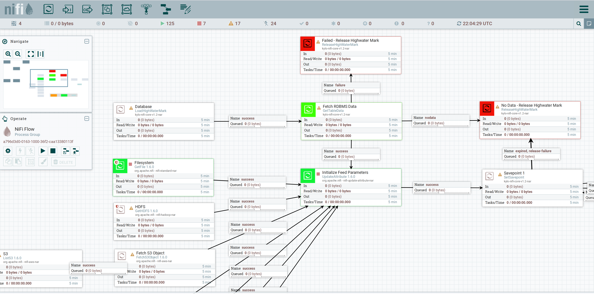

L’ingestion de données consiste à extraire, transformer et charger de grands volumes de données à partir de diverses sources, telles que des bases de données, des API, des serveurs FTP / SFTP, des fichiers, etc., dans un lac de données (_Data Lake_ en anglais).

"Data Lake" est un terme apparu au cours de cette décennie pour décrire un élément important du pipeline d'analyse de données dans le monde du Big Data. 

<!--more-->

L'idée est de disposer d'une zone de stockage unique pour toutes les données brutes que n'importe qui dans une organisation pourrait avoir besoin d'analyser. Habituellement, les gens utilisent Hadoop pour travailler sur les données du lac, mais le concept est plus large que Hadoop.

Pour rappel, il existe une distinction essentielle entre le lac de données et l’[entrepôt de données](https://fr.wikipedia.org/wiki/Entrep%C3%B4t_de_donn%C3%A9es) (et le [data mart](https://fr.wikipedia.org/wiki/Datamart)). Le lac de données stocke les données brutes, quelle que soit la forme fournie par la source de données :

- **Données structurées** issues de bases de données relationnelles (lignes, colonnes)
- **Données semi-structurées** : fichiers de logs, CSV, JSON, XML, etc.
- **Données non structurées** : emails, documents, PDFs mais aussi potentiellement des données binaires (images, audio, vidéo)

Il n'y a pas d'hypothèses sur le schéma des données, chaque source de données peut utiliser le schéma de son choix. Il incombe aux utilisateurs des données du lac de leur donner un sens pour leurs propres besoins.

Le lac de données est généralement défini comme un réservoir de données pour des opérations de type ETL (Extract-Transform-Load), ou comme un hub central pour l’analyse de données en libre-service. Le lac de données se réfère également aux outils de gestion de la donnée au sein de la plate-forme (stockage, monitoring, etc.)

# Les outils
Les outils classiques/historiques de la data ingestion (en tout cas, ceux que j'ai eu l'occasion de manipuler à maintes reprises) sont les suivants :

- **Apache Oozie**. Oozie est un ordonnanceur de workflows permettant de gérer des tâches Hadoop. Les workflows Oozie sont des graphes acycliques dirigés (DAG) composés d’actions. Les coordinators Oozie permettent de déclencher des workflows de façon récurrente, à une date et une heure spécifiées à l’avance (expression cron) et/ou à la disponibilitée de la donnée (ex : un fichier déposé dans un espace réseau dont le nom correspond à une expression régulière).
Oozie est intégré à l’écosystème Hadoop et prend en charge plusieurs types de tâches Hadoop prêtes à l'emploi (telles que map-reduce Java, Spark, Pig, Hive, Sqoop et DistCp) ainsi que des tâches spécifiques au système (telles que des programmes Java et des scripts shell).  
- **Apache Hive** est un entrepôt de données distribué intégré à Hadoop HDFS. Il fournit un langage de requêtes similaire à SQL, et convertit de manière transparente les requêtes en map-reduce Java, [Tez](https://tez.apache.org/) ou Spark. Hive est la solution principale de stockage des données source dans un cluster Hadoop.
- **Apache Sqoop** est un outil en ligne de commande pour transférer des données en masse depuis des bases de données relationnelles vers Hive. Il prend en charge le chargement différentiel d’une table ou d’une requête SQL depuis la dernière importation.
- **Apache Spark**. Spark est un framework de traitement distribué permettant d’exécuter des tâches map-reduce en mémoire. Spark SQL, notamment, permet d'exécuter des requêtes en langage SQL pour charger et transformer des données.

Beaucoup d'études ont été réalisées sur le bien-fondé des lacs de données et sur les raisons pour lesquelles certaines initiatives de data lake ont échoué dans de grandes entreprises.
Parmi ces raisons, on trouve que le problème réside dans les outils et les méthodes utilisés pour alimenter le lac de données. L'ingestion de données dépend encore trop souvent d'un développement personnalisé pour chaque système source. Des outils spécialement conçus et des scripts spécifiques rendent l'ingestion de données volumineuses complexe, longue et coûteuse. Le système n'est pas scalable du fait de la trop grande variété des sources, et de leurs volumes grandissants... Souvenez-vous, les [4 Vs du Big Data](https://www.ibmbigdatahub.com/infographic/four-vs-big-data) et les enjeux associés.
Aussi, l'ingestion de données est souvent exclusivement réalisée par une équipe technique. Notamment, les interfaces en ligne de commande des outils de traitement des données existants créent des dépendances pour les développeurs et entravent l'accès aux données et à la prise de décision.

# La révolution industrielle du Big data

Pourtant, la (quatrième) révolution industrielle promise par le Big Data est bel et bien arrivée... depuis quelques années déjà. Les volumes de données et la cadence à laquelle les données sont ingérées augmentent sans cesse. Plus que jamais on parle de temps réel, de données en mouvement. Le Big Data s'ouvre également à de nouveaux types de données : données capteurs avec l'IoT, séries temporelles continues, logs, etc.
Avant, on déposait les données directement dans Hadoop, à la main, en mode _batch_. Maintenant, on parle d'[architecture Lambda](https://en.wikipedia.org/wiki/Lambda_architecture), capable de traitements par lots et en flux (à ne pas confondre avec les Lambdas d'AWS et le serverless ou les expressions lambda de Java).
Les grandes distributions Hadoop se dotent ainsi de leur propre solution d'ingestion de données. Hortonworks Data Flow (HDF), par exemple, complète Hortonworks Data Platform (HDP) en regroupant Apache NiFi, Kafka et Storm.
Il existe de plus en plus d'outils en périphérie d'Hadoop dédiés à la collecte et au traitement des données. Pour preuve, le nombre grandissant de frameworks pour le traitement en streaming.

# Les frameworks orientés data
Il existe beaucoup d'outils et de frameworks orientés _data_ (data-driven).
\*Disclaimer\* : on ne parlera ici que des frameworks _open source_ de la fondation Apache.

De même qu'on parle de "persistance polyglotte" ou de "programmation polyglotte", l'idée ici est que l'ingestion de données devrait être opérée par un mélange de frameworks, afin de tirer parti du fait que différents frameworks sont adaptés à la résolution de problèmes différents. Des flux d'ingestion complexes combinent différents types de problèmes, et choisir le bon framework pour une tâche spécifique est plus productif que d'essayer de regrouper tous les aspects dans un seul framework.
Ainsi, la combinaison d’outils pour réaliser des tâches différentes de manière plus efficace permet une accumulation de fonctionnalités et une flexibilité accrue dans la gestion d’un ensemble plus vaste de scénarios : on parle alors d'architecture dite modulaire, plug-in ou encore de mashup.
Les outils et frameworks pouvant constituer une telle architecture et/ou compléter les outils actuels sont les suivants :

- **Courtage de données** : Kafka, Storm. Kafka est le standard de-facto pour le transport de flux de données à large échelle et permet notamment de répondre au problème de la _back pressure_ : les données sont produites plus vite qu’elles ne peuvent être ingérées dans le lac de données.
- **Agents légers** conçus pour le transfert de données : MiNiFi, Elastic Beats. Les agents sont installés sur les serveurs, au plus près des sources; ils collectent les données et les transfèrent vers le lac de données.
- **Orchestration/planification de workflows** : NiFi, Oozie
- **Traitement batch et/ou streaming** : Sqoop, Spark (Streaming), Flume, Beam, Flink, Apex, Samza...
- **Data wrangling** : Parce que les données dans le lac ne sont pas si brutes que ça, et qu'il faut parfois nettoyer, standardiser, filtrer les données en fonction de restrictions locales ou anonymiser les sources. OpenNLP, pour le traitement du langage naturel, est parfois utilisé dans ce contexte.

Hive peut également être complété par d’autres solutions de stockage pour d’autres besoins et selon d’autres paradigmes : Elasticsearch ou Solr pour indexer et rechercher des données, buckets S3, bases de données orientées colonnes Cassandra ou Hbase, etc.

Vous trouverez un comparatif complet des frameworks de traitement de flux [ici](https://www.digitalocean.com/community/tutorials/hadoop-storm-samza-spark-and-flink-big-data-frameworks-compared) et [là](https://medium.com/@chandanbaranwal/spark-streaming-vs-flink-vs-storm-vs-kafka-streams-vs-samza-choose-your-stream-processing-91ea3f04675b).

Dans le reste de cet article, nous allons voir qu'il existe des outils avancés permettant à des utilisateurs finaux d'opérer l'ingestion de données, tout en dissimulant les détails techniques qu'elle implique.

# Des outils tournés vers l'utilisateur final

## Gobblin
[Apache Gobblin](https://gobblin.apache.org/) est un framework développé initialement par LinkedIn (vous vous souvenez de Kafka!?) qui développait jusqu’alors des solutions customisées pour l’ingestion de données dans leur écosystème Hadoop, ce qui posait d’importants problèmes de qualité des données, de gestion des métadonnées, de développement et d’exploitation. Cette expérience a permis à LinkedIn de théoriser et de modéliser de manière très fine l’ingestion de données. Le code source de Gobblin a depuis été ouvert et offert à la fondation Apache. Le framework est cependant encore en incubation chez Apache, et si une interface Web fait partie de la feuille de route, elle n’est pas encore disponible. Le projet est très actif sur Github.

## Kylo
[Kylo](https://kylo.io/), avec Apache Gobblin, fait partie de ces nouveaux outils permettant à des utilisateurs finaux d'opérer un cluster Hadoop et de créer des flux d'ingestion complexes.

Kylo est une solution open source par Teradata pour la "création accélérée et la gestion de pipelines de données". Teradata propose également du support sur sa solution. La plate-forme est proposée sous licence Apache 2.0 et est élaborée sur la base de Hadoop, Spark et Apache NiFi. Teradata joue un rôle de leader en matière de gouvernance, d'intendance et de développement communautaire autour du projet open source Kylo.
Kylo fournit une interface utilisateur en libre-service et est certainement l’outil de gestion de lacs de données le plus avancé parmi tous les outils (open source) étudiés dans le cadre de cet article.

En termes de déploiement et d'architecture :

- Kylo est une application Web installée sur un noeud _edge_ Linux d'un cluster Spark & Hadoop.
- Kylo contient un certain nombre de routines spécialement conçues pour les opérations de Data Lake en utilisant Hive et Spark (_profiling_, validation et nettoyage des données, détection de schéma, etc.).
- **Kylo utilise Apache NiFi en tant que _scheduler_ (planification, ordonnancement de tâches) et moteur d'orchestration**, fournissant un framework intégré pour la conception de pipelines de données avec 200 "processeurs" prédéfinis (connecteurs à des sources de données, transformations). Nifi est fondé sur le [flow-based programming](https://en.wikipedia.org/wiki/Flow-based_programming).
- Kylo peut s'intégrer à Apache Ranger ou Sentry et à CDH Navigator (Cloudera) ou Ambari (Hortonworks) pour le _monitoring_ du cluster.
- Kylo peut être déployé dans le cloud.
- Kylo est Hautement Disponible (HA) si déployé en cluster accessible via un _Load Balancer_.  

> Kylo emploie des modèles d’ingestion réutilisables (templates Nifi).

**Apache NiFi constitue la base essentielle de Kylo.**
Les administrateurs de Kylo déterminent comment les utilisateurs peuvent configurer des flux en fonction de modèles de traitement. L’administrateur (ou plutôt ici le concepteur) est ainsi responsable du développement de ces modèles dans Apache NiFi. Une fois qu'un modèle a été enregistré dans Kylo via une interface d'administration, Kylo permet aux utilisateurs finaux de créer et de configurer des flux via un assistant (_wizard_) créé dynamiquement sur la base de ce modèle. L'utilisation de modèles rend donc Kylo hautement configurable.

Le concepteur détermine les paramètres pouvant être saisis par un utilisateur final dans l'interface de l'assistant, et comment ces champs sont affichés (par exemple : liste de sélection, fenêtre SQL, champ numérique, etc.), ainsi que les valeurs par défaut ou les contraintes. Les paramètres saisis servent à configurer les outils sous-jacents nécessaires au traitement du flux, en prenant en compte la sécurité, les exigences de la Data Governance et la gestion des erreurs. Les utilisateurs peuvent uniquement définir les paramètres exposés par le concepteur de modèles.
Les éléments du modèle qui réalisent le traitement du flux sont les processeurs NiFi. Il existe plusieurs types de processeurs, pour obtenir des fichiers, lire depuis Twitter ou Kafka, exécuter des requêtes SQL sur une base de données, compresser ou décompresser des fichiers, envoyer des données via SFTP ou supprimer un fichier dans Hadoop. Apache NiFi fournit toute une bibliothèque de processeurs standards. Apache Nifi est extensible : il est possible de développer ses propres processeurs. Ceci permet un développement rapide et des tests efficaces de nouveaux scénarios d’ingestion de données.

Kylo fournit une architecture de type plug-in avec une variété d'extensions à la disposition des développeurs, et l'utilisation de modèles NiFi offre une grande  flexibilité pour implémenter et expérimenter divers scénarios d’ingestion de données spécifiques à une entreprise, pour les cas d'utilisation par lots et en flux.

Vous trouverez une liste complète des fonctionnalités de Kylo [ici](https://kylo.readthedocs.io/en/v0.9.1/about/KyloFeatures.html).

# Et demain?

## Mettre en cache plutôt que copier les données?
L'ingestion de données, on l'a vu, consiste à collecter les données de différentes sources et à les dupliquer dans le Data Lake. Copier les données pour ne pas solliciter trop souvent les sources : en effet, les sources n'ont pas pour objectif de servir les données en dehors du contexte d'utilisation pour lequel elles ont été mises en place au départ (c'est-à-dire le seul projet ou système d'information ayant besoin de persister puis d'interroger ses données).
Copier les données aussi parce que la source de données n'est pas (facilement) accessible ou interrogeable, en dehors de ce contexte et du mode opératoire mis en place pour réaliser cette copie justement.

J'ai toujours pensé que c'était une faute de répliquer ainsi les données, sans compter que cela pose le problème majeur de la synchronisation des données du Data Lake avec les sources (mise à jour complète, incrémentale ou différentielle).
En effet, ne pourrait-on pas laisser les données là où elles résident? On pourrait ainsi les requêter seulement quand on en a besoin, et on serait assuré qu'elles sont bien à jour.

> On retrouve le concept cher à [Tim Berners-Lee](https://fr.wikipedia.org/wiki/Tim_Berners-Lee) du Web des données (_Linked Data_, en anglais). Le Web des données s'appuie sur les standards du Web (HTTP et URI), et permet d'interroger automatiquement les données, quels que soient leurs lieux de stockage, et sans avoir à les dupliquer.

Il faudrait pour cela augmenter la capacité des sources à présenter leurs données, en leur ajoutant un système de cache par exemple. En effet, la mise en cache peut améliorer la disponibilité des données en fournissant un service continu à des applications tierces - d'analyse de données en l'occurence - qui dépendent uniquement des données en cache, même si la source principale n'est pas disponible.
La mise en cache dans un environnement en cluster peut encore augmenter la disponibilité des données et assure l'équilibrage de la charge des requêtes.

Bon nombre de produits proposent une couche intermédiaire d'accès aux données entre le stockage (fichiers, SGBDRs, stockage objet, etc.) et les applications de traitement :

- [Couchbase](https://www.couchbase.com/fr) ou [Redis](https://redis.io/) supportent divers scénarios de mise en cache distribuée
- [Apache Ignite](https://ignite.apache.org/) propose une plate-forme de mise en cache
- [Alluxio](https://www.alluxio.org/), anciennement Tachyon, certainement la plate-forme de mise en cache la plus populaire à ce jour
- [Hazelcast](https://en.wikipedia.org/wiki/Hazelcast), [Infinispan](http://infinispan.org/), etc., d'autres plates-formes distribuées
- CSQL Cache, TimesTen, SafePeak, Tarantool, Heimdall Data proposent des caches pour des bases de données SQL
- [memcached](https://memcached.org/)

Ces services de mise en cache partagés et distribués apportent un véritable gain de performance en plaçant en mémoire de manière transparente les données fréquemment utilisées. Ils gèrent également la communication entre les applications et le stockage en traduisant automatiquement les demandes d'accès aux données des applications vers toute interface de stockage persistant sous-jacente.

Finalement, quand on y réfléchit, un Data Lake peut être vu comme un cache géant regroupant toutes les données d'une entreprise.
Si le Data Lake d'aujourd'hui utilise plutôt des solutions de stockage durable (sur disque), le Data Lake du futur fera la part belle aux solutions de stockage en mémoire.

## Désilotage des données
> L'enjeu principal du Data Lake est de *désiloter* les données.

La majorité des entreprises gardent leurs données dans des sources de données qui ne communiquent pas entre elles : les silos.
Il n'est pas rare de rencontrer de tels silos dans les grandes entreprises, où chaque canal dépend de son propre service et où les services ont leurs propres objectifs, budgets, etc.
Le Data Lake doit donc favoriser la publication de données, non pas sous la forme de silos de données isolés les uns des autres, mais en les reliant entre elles pour constituer un réseau global d'informations.

Si le Data Lake n'est pas responsable du merge et de la réconciliation des données (c'est justement la tâche des projets d'analyse en aval), il doit en revanche fournir les moyens d'y parvenir, notamment un catalogue de données pour répertorier les ensembles de données et permettre leur découverte. Il doit également fournir un index complet pour la recherche et la localisation des sources.
Enfin, le Data Lake peut fournir une façade aux utilisateurs finaux, et jouer le rôle de proxy pour interroger les données depuis les sources d’origine, avec un générateur de requêtes SQL par exemple.

## Lambda est mort, Vive Lambda !

Dans une architecture Lambda moderne, typique des écosystèmes IoT, certaines des sources (des capteurs par exemple) n'ont pas de stockage, mais produisent plutôt des flux de données. Dans ce cas, vous aurez besoin d’un pipeline d’ingestion, qui capture les données, les conserve dans un buffer, applique potentiellement certaines transformations et finit éventuellement par les déposer dans le lac. Kafka et Spark Streaming sont des outils communs dans ce domaine.

Dans ce cas, conserver (temporairement) les données dans le lac permet de les traiter et de les analyser _a posteriori_, si un traitement à la volée n’est pas possible (_streaming analytics_). Le Data Lake joue bien le rôle de cache de données.

En conclusion, les architectures de Big Data évoluent et se multiplient sans cesse. On parle d'architecture Lambda, mélangeant les traitements en batch et en temps réel; d'architecture [Kappa](https://www.oreilly.com/ideas/questioning-the-lambda-architecture), où tout est flux; SMACK pour Spark-Mesos-Akka-Cassandra-Kafka, l'équivalent de la stack LAMP pour le Big Data, etc.
Les usages évoluent également : on traite de plus en plus de logs applicatifs, de séries temporelles, de données capteurs...
Peu importe les patterns d'architecture mis en oeuvre et les lettres grecques utilisées pour les désigner, une bonne architecture de Big Data est une architecture évolutive, capable de composer avec différents outils et de s'adapter à de nouveaux besoins, tout simplement.

---
Pour aller plus loin :

- [Gartner Says Beware of the Data Lake Fallacy](https://www.gartner.com/newsroom/id/2809117)
- [Gartner Reveals the 2017 Hype Cycle for Data Management](https://www.gartner.com/en/newsroom/press-releases/2017-09-28-gartner-reveals-the-2017-hype-cycle-for-data-management)
- [Why Data Lakes Are Evil](https://www.forbes.com/sites/danwoods/2016/08/26/why-data-lakes-are-evil/#5291a9e44f73)
- [The Future Architecture of a Data Lake : In-memory Data Exchange Platform Using Tachyon and Apache Spark](https://content.pivotal.io/blog/the-future-architecture-of-a-data-lake-in-memory-data-exchange-platform-using-tachyon-and-apache-spark)
