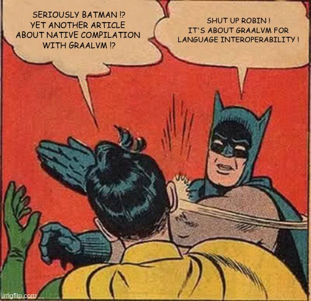
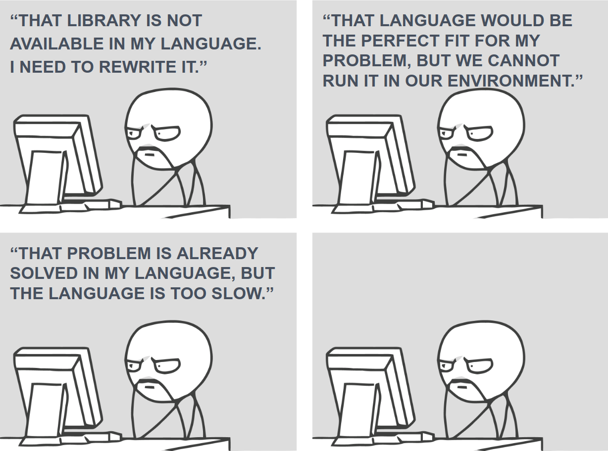

GraalVM is a Java VM - _runtime and compiler_ - based on HotSpot/OpenJDK for the Community Edition and on Oracle JDK for 
the Enterprise Edition. Among the goals of the project, GraalVM strives for improving the performance of JVM-based 
languages, such as Groovy, Scala and Kotlin, to match the performance of native languages. GraalVM can also produce 
native code thanks to the Ahead-Of-Time compilation - as opposed to the classic Just-In-Time compilation - which greatly 
reduces the startup time and the memory footprint of Java applications. Last but not least, GraalVM allows freeform 
mixing of code from any programming language in a single program, namely "polyglot applications".   

<!--more-->

The main argument in favor of GraalVM as a Polyglot Platform, and cross-language interoperability in general, is the 
reuse of existing code, much like inheritance in object-oriented programming languages whereby a subclass re-uses code 
in a base class (at least, it was the "silver bullet" announced with the rise of OO languages). Except that here, we get 
rid of the limits of the programming language and its ecosystem. Indeed, a programming language rarely comes alone: a 
language is often accompanied by standard/core libraries for commonly used algorithms such as sorting algorithms, data 
structures such as lists, trees, and hash tables, and base mechanisms for input/output. These libraries can even be
 an integral part of certain syntactic constructs of the language. For instance, in Java, a string literal is defined
  as an instance of the `java.lang.String` class: there is no primitive type for a string. Afterwards, it depends on
   the language philosophy: TODO see https://en.wikipedia.org/wiki/Standard_library. The more a language is adopted
   ,  the bigger the set of these libraries.
 
siloed environment and a closed world

A language can have its own characteristics that make it suitable for a given problem.   

there are a lot of precedents and attempts to achieve language interoperability

> "Whatever we do, we always end up inserting corrupted data into the system" - *The client*

Let's say that a customer comes to us with the following problem: *they* maintain a Web application for many years.
This application follows the three-tier architecture model where presentation, application processing and data
 management are developed and maintained as independent modules.

